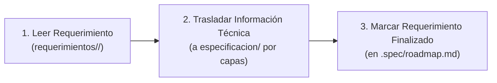

# Guía de Especificación Técnica, Arquitectura por Capas y Definition of Done — MediStack

Este documento centraliza los estándares de ingeniería de software, arquitectura de especificación técnica, organización por capas dentro de `especificacion/`, Definition of Done (DoD) y el checklist de avance para la **Fase 0 (Diseño y Especificación)** de MediStack.

---

## 1. Arquitectura de la Especificación Técnica: Organización por Capas

En MediStack, la especificación técnica no se dispersa en los archivos de requerimientos. Los requerimientos funcionales en `requerimientos/` actúan exclusivamente como insumo de lectura. La especificación técnica global se centraliza y consolida en la carpeta `especificacion/`, estructurada formalmente en capas de documentación técnica en español:

```text
especificacion/
├── basededatos/                         # Capa de Persistencia y Datos
│   ├── diccionario_datos.md             # Diccionario consolidado de tipos SQL Server, PKs, FKs, restricciones
│   ├── diagrama_er.md                   # Diagrama Entidad-Relación global (Mermaid erDiagram)
│   └── tablas/                          # Scripts SQL descriptivos (CREATE TABLE IF NOT EXISTS / DDL conceptual)
├── dominio/                             # Capa de Modelo de Dominio
│   ├── clases/                          # Clases de dominio descriptivas en C# (propiedades, enums, relaciones)
│   └── diagrama_clases.md               # Diagramas de clases de dominio conceptuales
├── paginas/                             # Prototipos Visuales y Vistas
│   └── [nombre_pagina].html             # Vistas HTML/CSS estáticas, accesibles y responsivas (sin backend)
└── incognitas/                          # Gobernanza de Riesgos y Supuestos
    └── registro_incognitas.md           # Catálogo unificado de dudas, riesgos, supuestos y decisiones pendientes
```

---

## 2. Flujo de Trabajo Operativo por Requerimiento

Para cada requerimiento modular existente en `requerimientos/`, se ejecuta de forma rigurosa el siguiente ciclo de 3 pasos:



1. **Paso 1: Leer requerimiento:**
   - Tomar el requerimiento funcional desde `requerimientos/<modulo>/requerimiento.md`.
   - Analizar inputs, procesamiento, outputs, estados, transiciones y manejo de excepciones funcionales.
   - Identificar entidades, tablas asociadas, reglas de negocio e impacto en interfaz.

2. **Paso 2: Pasar información técnica a `especificacion/`:**
   - **Persistencia (`basededatos/`):** Registrar campos en el diccionario de datos y redactar la propuesta de tablas SQL en `especificacion/basededatos/`.
   - **Entidades y Dominio (`dominio/`):** Incorporar las clases de dominio C# descriptivas a `especificacion/dominio/`.
   - **Páginas y Prototipos (`paginas/`):** Crear o vincular el prototipo visual HTML/CSS estático si el módulo introduce interfaz gráfica en `especificacion/paginas/`.
   - **Incógnitas (`incognitas/`):** Asentar cualquier supuesto, duda o decisión pendiente en `especificacion/incognitas/`.

3. **Paso 3: Marcar requerimiento como finalizado:**
   - Registrar la finalización del módulo en [`.spec/roadmap.md`](file:///C:/Users/ujr001/proyectos/medistack/.spec/roadmap.md).

> [!IMPORTANT]
> **Sin enriquecimiento en requerimientos:** La carpeta `requerimientos/` permanece intacta como fuente de especificación funcional de origen. No se crean tablas, clases ni documentos de diseño técnico dentro de las carpetas de `requerimientos/`.

---

## 3. Convenciones Técnicas de la Especificación por Capas

Para garantizar orden, modularidad y compatibilidad con el stack .NET / SQL Server, rigen las siguientes convenciones obligatorias:

### 3.1. Granularidad por Archivo Componente (Modularidad)
No se utilizan archivos monolíticos extensos. Cada entidad, tabla o vista se define en su propio archivo descriptivo:
- **Tablas SQL:** Un archivo `.sql` por tabla en `especificacion/basededatos/tablas/[NombreTabla].sql`.
- **Clases de Dominio:** Un archivo `.cs` por entidad descriptiva en `especificacion/dominio/clases/[NombreEntidad].cs`.
- **Prototipos de Páginas:** Archivos estáticos `.html` en `especificacion/paginas/[nombre_pagina].html`.

### 3.2. Evolución Incremental de Entidades Compartidas
Entidades compartidas por múltiples módulos (como `Usuario`, `Paciente` o `Turno`) evolucionan de forma incremental:
- Si un requerimiento posterior requiere agregar campos, relaciones o índices a una tabla o clase ya existente en `especificacion/`, **se actualiza directamente el archivo existente**.
- En el encabezado del archivo y en las notas del requerimiento se deja asentado el motivo y el nuevo requerimiento que lo justificó.

### 3.3. Encabezado Obligatorio de Trazabilidad
Todo artefacto técnico en `especificacion/` debe incluir en sus primeras líneas un encabezado de trazabilidad hacia los requerimientos de origen:
- **En archivos C# (`.cs`):**
  ```csharp
  // ============================================================================
  // MediStack — Capa de Dominio
  // Requerimientos origen: Req 01 (Registrar Usuarios), Req 03 (Pacientes)
  // Descripción: Representa el modelo descriptivo de Usuario en la plataforma.
  // ============================================================================
  ```
- **En archivos SQL (`.sql`):**
  ```sql
  -- ============================================================================
  -- MediStack — Capa de Base de Datos
  -- Requerimientos origen: Req 01 (Registrar Usuarios)
  -- Descripción: Propuesta DDL de tabla para almacenamiento de usuarios y roles.
  -- ============================================================================
  ```

### 3.4. Ciclo de Presentación Consolidada y Aprobación Humana
- Al procesar un requerimiento, el agente analiza el insumo funcional y elabora la propuesta técnica completa en un solo lote consolidado:
  1. Tablas y tipos SQL (`basededatos/`).
  2. Clases de dominio (`dominio/`).
  3. Páginas y prototipos visuales HTML/CSS (si aplica en `paginas/`).
  4. Incógnitas registradas (`incognitas/`).
- **El agente debe presentar este lote técnico consolidado para aprobación humana explícita del usuario** antes de dar por cerrado el módulo y marcarlo en el roadmap.

---

## 4. Definition of Done (DoD) para cada Requerimiento

Un módulo funcional de `requerimientos/` se considera **finalizado (Done)** únicamente cuando:

1. [ ] El requerimiento fuente fue leído y analizado en su totalidad.
2. [ ] Las entidades involucradas fueron incorporadas en sus archivos `.cs` individuales en `especificacion/dominio/clases/` con su encabezado de trazabilidad.
3. [ ] Las tablas y columnas fueron tipadas con tipos nativos de SQL Server (`INT`, `BIGINT`, `UNIQUEIDENTIFIER`, `NVARCHAR`, `DATETIME2`, `DECIMAL`, `BIT`) en sus archivos `.sql` individuales en `especificacion/basededatos/tablas/` con encabezado de trazabilidad.
4. [ ] Se elaboró el prototipo visual HTML/CSS correspondiente (si aplica al requerimiento) en `especificacion/paginas/`.
5. [ ] Se registraron las incógnitas, supuestos y decisiones técnicas en `especificacion/incognitas/`.
6. [ ] La propuesta técnica completa fue revisada y aprobada por el usuario.
7. [ ] Se actualizó la casilla correspondiente en [`.spec/roadmap.md`](file:///C:/Users/ujr001/proyectos/medistack/.spec/roadmap.md).

---

## 5. Checklist Maestro de Módulos a Procesar

- [ ] **Módulo 01:** Registrar e iniciar sesión de usuarios (`requerimientos/01_RegistrarUsurios/`).
- [ ] **Módulo 02:** Gestión integral de turnos (`requerimientos/02_GestionarTurnos/`).
- [ ] **Módulo 03:** Gestión y padrón de pacientes (`requerimientos/03_GestionPacientes/`).
- [ ] **Módulo 04:** Gestión de profesionales, matrículas y disponibilidad (`requerimientos/04_GestionProfesionales/`).
- [ ] **Módulo 05:** Obras sociales y convenios tripartitos (`requerimientos/05_GestionarObrasSociales/`).
- [ ] **Módulo 06:** Ficha médica e historial cronológico de turnos (`requerimientos/06_FichaMedicaPaciente/`).
- [ ] **Módulo 07:** Cobros, copagos, señas y caja diaria (`requerimientos/07_CobrosCajaDiaria/`).
- [ ] **Módulo 08:** Conciliación y registro de ausentes (`requerimientos/08_RegistrarAusentes/`).
- [ ] **Módulo 09:** Liquidación periódica de honorarios profesionales (`requerimientos/09_LiquidacionHonorarios/`).
- [ ] **Módulo 10:** Reportes y métricas de gestión administrativa (`requerimientos/10_ReportesAdministrativos/`).
- [ ] **Módulo 11:** Asistente Clínico de IA (`requerimientos/11_Agente_IA/`).
- [ ] **Requerimientos No Funcionales:** Desempeño, seguridad, disponibilidad y accesibilidad (`requerimientos/RequerimientosNoFuncionales.md`).
