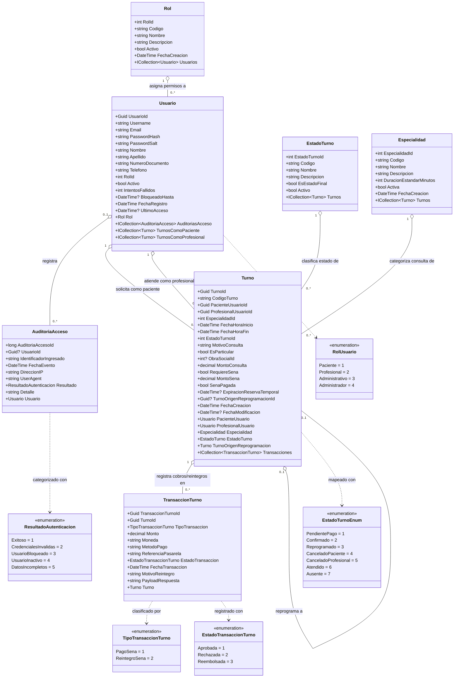

# Diagrama de Clases de Dominio — MediStack

> **Requerimientos origen:** [Req 01 (Registrar Usuarios)](file:///C:/Users/ujr001/proyectos/medistack/requerimientos/01_RegistrarUsurios/requerimiento.md), [Req 02 (Gestionar Turnos)](file:///C:/Users/ujr001/proyectos/medistack/requerimientos/02_GestionarTurnos/requerimiento.md)  
> **Estado:** Aprobado (Verificado por el usuario)

